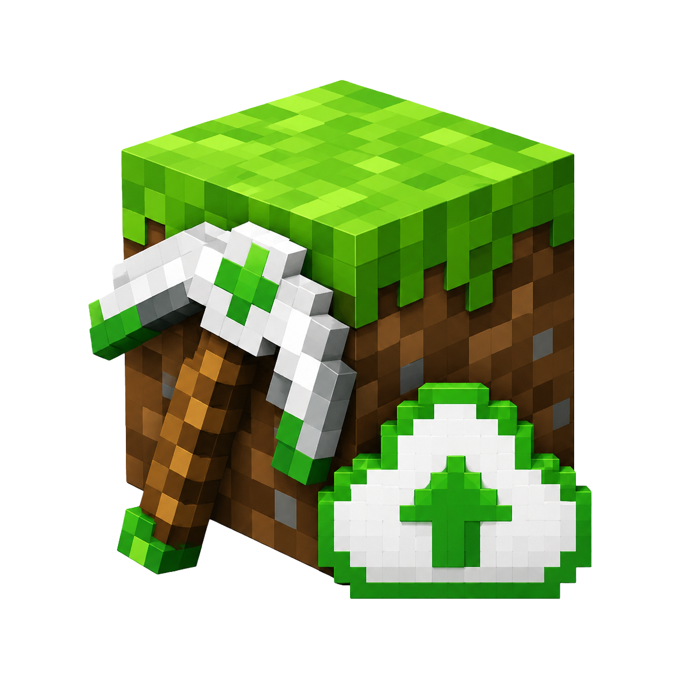

<p align="center">
  
</p>

# Mine AutoBackup

Windows tray app for backing up selected Minecraft worlds to Google Drive.

Built with Tauri, Vite, React, Tailwind CSS, and Rust.

## Features

- Runs as a small Windows tray app.
- Connects to Google Drive with OAuth.
- Lists Minecraft worlds from `.minecraft/saves`.
- Lets the user choose which worlds to back up.
- Creates compressed `.zip` backups.
- Uploads backups to a `Mine AutoBackup` folder in Google Drive.
- Supports manual and scheduled backups.

## Setup

Create a `.env` file from the example:

```powershell
Copy-Item .env.example .env
```

Fill in your Google OAuth desktop credentials:

```env
GOOGLE_OAUTH_CLIENT_ID=your-client-id
GOOGLE_OAUTH_CLIENT_SECRET=your-client-secret
```

The Google Cloud project must have the Google Drive API enabled.

## Development

```powershell
npm install
npm run tauri:dev
```

## Build

```powershell
npm run tauri:build
```

Installers are generated under:

```text
src-tauri/target/release/bundle/
```

## Website

The GitHub Pages landing page lives in `docs/`.

Downloads are loaded from the latest GitHub Release.

Every push to `main` builds Windows installers and updates the rolling
`latest` release. Push a tag like `v0.1.0` to publish a versioned release.

## License

MIT
